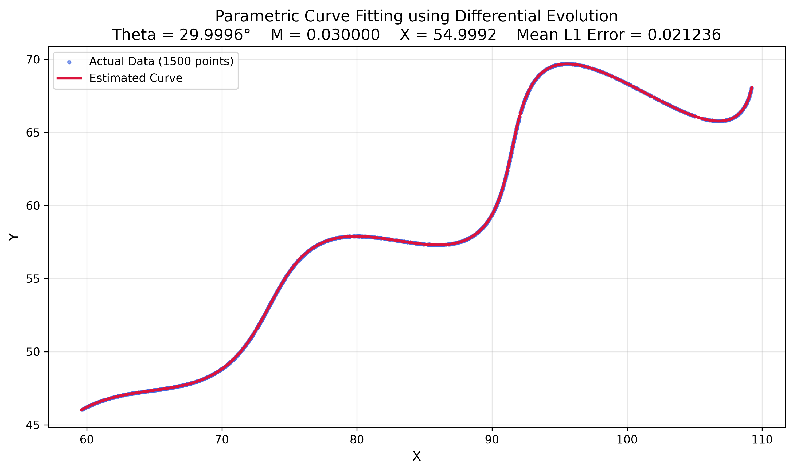
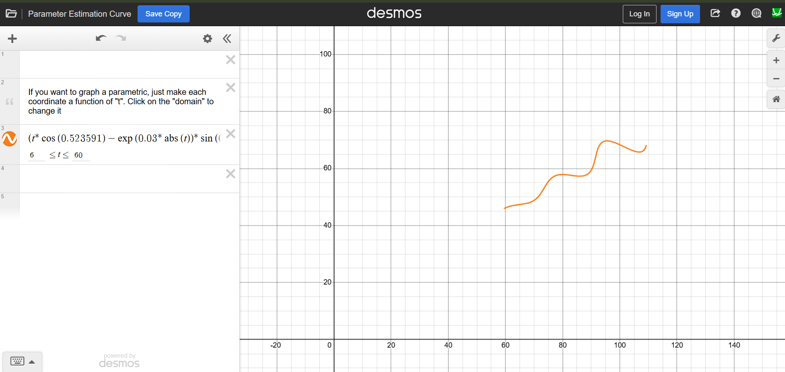

# AI Research & Development Assignment
### Parametric Curve Fitting using Differential Evolution

This repository contains my solution for the AI Research & Development assignment. The objective is to estimate the unknown parameters of a nonlinear parametric curve by minimizing the distance between the generated curve and the provided dataset using a global optimization algorithm.

---

# Problem Statement

Given a set of 1500 two-dimensional data points (`xy_data.csv`), estimate the parameters **θ (Theta)**, **M**, and **X** of the following parametric curve.

### Parametric Equations

\[
x(t)=t\cos(\theta)-e^{M|t|}\sin(0.3t)\sin(\theta)+X
\]

\[
y(t)=42+t\sin(\theta)+e^{M|t|}\sin(0.3t)\cos(\theta)
\]

### Parameter Constraints

| Parameter | Range |
|-----------|----------------|
| θ | 0° < θ < 50° |
| M | -0.05 < M < 0.05 |
| X | 0 < X < 100 |
| t | 6 ≤ t ≤ 60 |

The objective is to determine the optimal parameter values that minimize the fitting error between the generated curve and the observed dataset.

---

# Methodology

The solution follows the workflow below:

1. Load the dataset using **Pandas**.
2. Generate uniformly sampled values of **t** in the interval **[6, 60]**.
3. Construct the parametric curve using the unknown parameters.
4. Build a **KD-Tree** for efficient nearest-neighbour search.
5. Define the objective function as the mean nearest-neighbour distance between generated and observed points.
6. Optimize the parameters using **Differential Evolution** from SciPy.
7. Generate the fitted curve.
8. Visualize the actual and predicted curves.

---

# Why Differential Evolution?

The optimization problem contains nonlinear exponential and trigonometric terms, resulting in a highly non-convex search space with multiple local minima.

Differential Evolution was selected because it:

- Performs a global search over the parameter space.
- Does not require gradient information.
- Is robust against local minima.
- Produces reliable solutions for nonlinear optimization problems.

---

# Estimated Parameters

| Parameter | Estimated Value |
|-----------|----------------:|
| θ | **29.999557°** |
| M | **0.030000** |
| X | **54.999214** |
| Mean L1 Error | **0.021236** |

The estimated parameters closely match the underlying curve, producing an accurate fit with a very low reconstruction error.

---

# Visualization

## Curve Fitting Result



The fitted curve almost perfectly overlaps the observed dataset, demonstrating the effectiveness of Differential Evolution for nonlinear parameter estimation.

---

## Desmos Verification

The optimized curve was also verified using **Desmos**.



### Desmos Equation

```text
(t*cos(0.523591)-exp(0.03*abs(t))*sin(0.3*t)*sin(0.523591)+54.999214,
42+t*sin(0.523591)+exp(0.03*abs(t))*sin(0.3*t)*cos(0.523591))
```

---

# Project Structure

```
.
├── plots
│   ├── comparison.png
│   └── desmos_result.png
├── estimate_parameters.py
├── notebook.ipynb
├── requirements.txt
├── results.txt
├── xy_data.csv
├── README.md
└── .gitignore
```

---

# Dependencies

- Python 3.10+
- NumPy
- Pandas
- SciPy
- Matplotlib

Install all dependencies using:

```bash
pip install -r requirements.txt
```

---

# How to Run

```bash
python estimate_parameters.py
```

The script will:

- Estimate θ, M and X
- Generate the fitted curve
- Save the estimated parameters in `results.txt`
- Save the comparison plot in `plots/comparison.png`

---

# Computational Efficiency

To efficiently evaluate the objective function, a **KD-Tree** is used for nearest-neighbour search between generated and observed points. This significantly reduces computation time compared to a brute-force search, enabling efficient optimization over multiple Differential Evolution iterations.

---

# Future Improvements

Potential extensions include:

- Bayesian Optimization
- CMA-ES based optimization
- Robust loss functions for noisy datasets
- Multi-objective optimization
- Automatic estimation of parameter bounds

---

# Author

**V. V. N. S. Poorna Chandrika**

B.Tech Computer Science (Artificial Intelligence)

Amrita Vishwa Vidyapeetham
